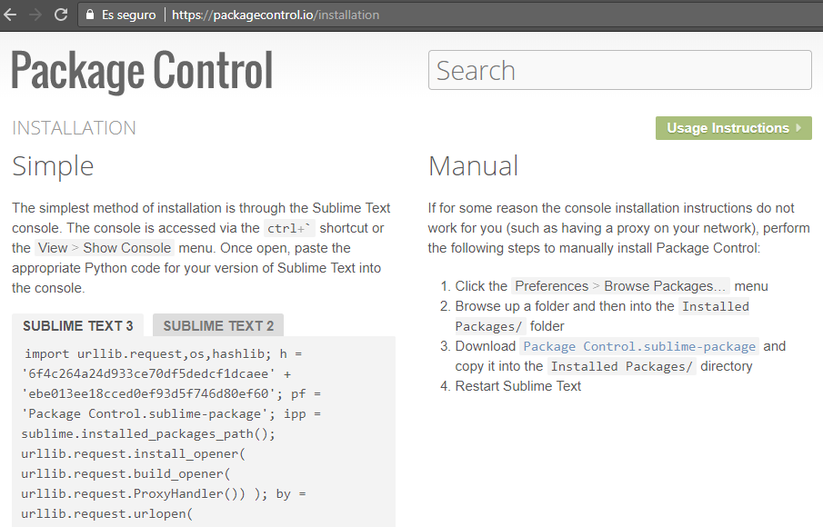
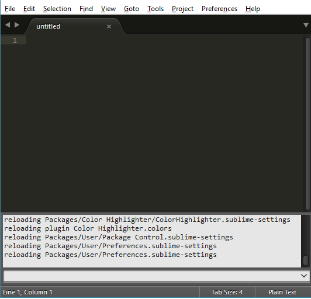

<h3> Semana 1 </h3>
<h1> Configurando entorno de trabajo </h1>

***

<h2>3. Editor de código</h2>

Existen gran variedad de editores para trabajar y cada uno tiene sus ventajas e inconvenientes, entre ellas tenemos: [SublimeText][1] , [BracketsIO][2], [Atom][3], [Visual Studio Code][4], [KomodoEdit][5],  entre otras opciones. 

[1]: https://www.sublimetext.com/
[2]: http://brackets.io/
[3]: https://atom.io/
[4]: https://code.visualstudio.com/#meet-intellisense
[5]: https://www.activestate.com/komodo-ide/downloads/edit

 En esta oportunidad trabajaremos *SublimeText3* y el SO Windows10, cabe destacar que tú decides que editor usar.

<h4>Paso 1: </h4>

+ Descargar de esta ruta [Descargar SublimeText][1] para los sistemas operativos GNU/LINUX, WINDOWS, MAC OS X.
  
<h4>Paso 2: </h4>

+ Luego de instalarlo, debemos instalar el Package Control (gestor de instalación de paquetes permite instalar plugins): 

Para su instalación inicial, visitaremos la web: https://packagecontrol.io/ . En ella encontraremos un código específico para la versión 2 o 3, que se nos pide copiar en primer lugar.   

 

Una vez copiado, abrimos Sublime Text 3, y elegimos en el menú *View > Show Console*

Se abrirá en la zona inferior una ventana de consola de desarrollo. En ella pegaremos los contenidos copiado anteriormente de la web, pulsando intro para ejecutar el código.

<h4>Paso 3:</h4>

+ Instalar los plugins que creas necesario. Visita este [enlace][6].

[6]: http://www.gitmedio.com/gitmedio/11-plugins-imprescindibles-para-sublime-text-3/

