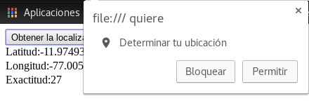

<h3> Semana 1 </h3>
<h1> Iniciando con HTML </h1>

<h2>4. Primeros Pasos</h2>

HTML (HyperText Markup Language) es el primer lenguaje que una persona debe conocer si desea comenzar a realizar páginas web, no es un lenguaje de programación, sino un lenguaje descriptivo, una serie de etiquetas que el navegador interpretará de una u otra forma para mostrar distintos contenidos por pantalla.

<h3>4.1 Estructura básica</h3>

- Digita este cógido en sublime y guárdalo con la extensión .html  *Ejemplo: index.html*

```html
<!DOCTYPE html>
<html lang="es">
    <head>
        <-- Título de la página web -->
        <title>Hackspace</title>

        <!-- Meta se utiliza para añadir información sobre la página -->
        <meta charset="utf-8"/>
        <!-- Descripcion de la pagina -->
        <meta name="description" content="Pagina de HTML5"/>
        <!-- Palabras clave -->
        <meta name="keywords" content="htm5, css3, Javascript"/>
        <!-- con esto refrescamos la pagina cada 200seg -->
        <meta http-equiv="Refresh" content="200; URL=http://www.google.com.pe">

        <!-- La etiqueta <link> define un vínculo entre un documento y un recurso externo. -->
        <!-- rel especifica la relación entre el documento actual y el documento vinculado -->
        <link rel="stylesheet" type="text/css" href="theme.css">

    </head>

    <body>

        <h1 title="esto se muestra cuando pasamos encima el raton">Esto es h1</h1>
        <h2>Esto es h2</h2>
        <h3>Esto es h3</h3>
        <p> Esto es un parrafo </p>
        <a href="https://www.google.com">Esto es un link</a>
        <!-- este es un salto de linea -->
        <br>
        <mark> Esto esta marcado</mark>
        <br>
        <em> Enfasis</em>
        <br>
        <strong> Texto importante </strong>
        <br>
        <small> Presentar textos legales</small>
        <br>
        <cite> Para referenciar o hacer citas a libros</cite>
        <p>Mi color favorito es:  <del>azul</del> y rojo.</p>
        <!-- Esto es una linea divisoria -->
        <hr>
        <p>Mi color  <ins>favorito es:</ins> rojo.</p>
        <p>Esto es <sub>subscripted</sub> text.</p>
        <p>Esto es <sup>superscripted</sup> text.</p>
        <br>
        <!-- El texto dentro de un elemento <pre>
        se muestra en una fuente de anchura fija (normalmente Courier) y
        conserva espacios y saltos de línea: -->
        <pre>
            Acuérdate del día, 
            acuérdate del mes, 
            acuérdate del beso 
            que nos dimos la primera vez.
        </pre>
        <address>
            Da informacion de contacto va dentro de footer
        </address>
        <br>
         Hoy es : <time datetime="2017/12/20"> 20/12/2017 </time>
    </body>
</html>
```
- Ábrelo con el navegador y visualiza los resultados. 

<p align="center"> </p>

<h3>Elementos</h3>

- **header** : Marca la cabecera de una página (contiene el logotipo del sitio, una imagen, un cuadro de búsqueda, etc).
- **nav** : Representa una parte de una página que enlaza a otras páginas o partes dentro de la página.
- **section** : Representa un documento genérico o de la sección de aplicación.
- **footer** : Se utiliza para indicar el pié de la página o de una sección.
- **aside** : El elemento aside representa una nota, un consejo, una explicación.
- **article** : Representa una entrada independiente en un blog, revista, periódico etc.

La anterior estructura se vería así:

<p align="center"> </p>

Ejemplo: 

```html
<!DOCTYPE html> 
<html> 
    <head> 
    <meta charset="UTF-8">
    <title>Elementos semánticos del HTML5</title> 
    </head> 
    <body> 
    <header> 
        <h1>Encabezado de la página</h1> 
    </header> 
    <nav> 
        <p>enlaces de navegación</p> 
    </nav> 
    <section> 
        <p>Sección 1</p> 
    </section> 
    <section> 
        <p>Sección 2</p> 
    </section>
    <aside>
        <p>Publicidad</p>
    </aside>
    <footer> 
        <p>Pié de página</p> 
    </footer> 
    </body> 
</html> 
```
<h3>4.2 Hipervínculos</h3>

Estos nos permiten cargar otra página en el navegador. 
- Sintaxis
```html
<a href="conocenos.html">Conócenos</a>
```
- Sintaxis para disponer un hipervínculo a otro sitio de internet.
```html
<a href="http://www.google.com">Buscador Google</a>
```
- Imágenes
```html
 
```
- Imágenes con hipervínculo
```html
<a href="pagina2.html"> </a>
```

<h4> Ejemplo </h4>

```html
<!DOCTYPE html>
<html lang="es">
    <head>
        <title>Hackspace</title>
    </head>

    <body>
        
        <a href="https://github.com/ISABELUNA16/HackSpace-IntroductionFrontend/wiki">Bienvenido al CoreUpgrade 2018</a>
    </body>
</html>
```

<p align="center"> </p>

<h3>4.3 Tablas</h3>

Para la creación de una tabla intervienen una serie de elementos:

- **table** Es la marca de comienzo de la tabla.
- **tr** Es la marca de comienzo de una fila.
- **td** Es la marca de comienzo de una celda. 

```html
<!DOCTYPE html>
<html>
    <head>
        <title>Ejemplos</title>
        <meta charset="UTF-8">
    </head>
    <body>
        <table border="1">
        <tr>
            <td rowspan="4">Recursos</td><td colspan="4">Facturación</td>
        </tr>
        <tr>
            <td>Discos Duros</td><td>2000</td><td>27200</td><td>26000</td>
        </tr>
        <tr>
            <td>CPU</td><td>73000</td><td>64300</td><td>51000</td>
        </tr>
        <tr>
            <td>Monitores</td><td>53700</td><td>12000</td><td>88000</td>
        </tr>
        </table>
    </body>
</html>
```

La tabla anterior se vería de esta manera:

<p align="center"> </p>

<h3>4.4 Formulario</h3>
Un formulario permite que el visitante al sitio cargue datos y sean enviados al servidor.

Ejemplo:

```html
<!DOCTYPE html>
<html>
    <head>
        <title>Prueba de formulario</title>
        <meta charset="UTF-8">
    </head>
    <body>
        <form action="·" method="post">
        Ingrese su nombre: 
        <input type="text" name="nombre" size="20">
        <br>
        Ingrese su clave: 
        <input type="password" name="clave" size="12">
        <br>
        <input type="submit" value="enviar">
        <input type="reset" value="borrar">
        </form>
    </body>
</html>
```

El anterior ejemplo se vería de esta manera:

<p align="center"> </p>


<h3>4.5 Inputs</h3>
Para utilizar estos nuevos controles hay que definir el tipo en la propiedad type del control input.

- Email
```html
<input type="email" id="emailusuario" required><a href="conocenos.html">Conócenos</a>
```
- Range
```html
<input type="range" id="temperatura" min="0" max="100">
```
- Date
```html
<input type="date" id="fecha1" name="fecha1">
```
    *Dependiendo el navegador mostrará un calendario con un formato particular.*

- Number 
```html
<input type="number" id="valor" name="valor" min="1" max="10">
```

<h3>4.6 WebStorage</h3>

El objeto **localStorage** nos permite almacenar datos que serán recordados por el navegador para siempre, es decir no tienen una fecha de caducidad.

La cantidad de información que podemos almacenar es muy superior a la permitida con las cookies, el localStorage permite almacenar por lo menos 5 Mb.

*Cuenta con dos métodos fundamentales para grabar y recuperar datos*
- localStorage.setItem ( [clave] , [valor])
- localStorage.getItem ( [clave] )

Para este ejemplo haremos uso del lenguaje de programación Javascript.

Ejemplo: 

Confeccionar una aplicación que permita administrar un diccionario ingles/castellano, almacenar en forma local dichos datos.

```html
<!DOCTYPE HTML>
<html>
<head>
  <title>Título de la página</title>  
  <meta charset="UTF-8">
  
<script>

    window.addEventListener('load', inicio, false);

    function inicio() {
        document.getElementById('guardar').addEventListener('click', guardar, false);
        document.getElementById('traducir').addEventListener('click', recuperar, false);
    }

    function guardar(evt) {
        localStorage.setItem(document.getElementById('ingles').value, document.getElementById('castellano').value);        
        document.getElementById('ingles').value='';
        document.getElementById('castellano').value='';
    }

    function recuperar(evt) {
        if (localStorage.getItem(document.getElementById('ingles').value) == null) 
            alert('No está almacenala la palabra '+document.getElementById('ingles').value);
        else  
            document.getElementById('castellano').value=localStorage.getItem(document.getElementById('ingles').value);
    }

</script>  
  
</head>
<body>
  Palabra en ingles:
  <input type="text" id="ingles">
  <input type="button" id="traducir" value="Traducir"> 
  <br>      
  Palabra en castellano:
  <input type="text" id="castellano">
  <br>
  <input type="button" id="guardar" value="Guardar">
</body>
</html>
```

Para poder visualizar el anterior ejemplo hemos hecho el uso del Inspector de Google Chrome:

<p align="center"> </p>


<h3>4.7 Geolocation</h3>

La geolocalización es una característica de HTML5 que nos permite acceder a ubicación geográfica del usuario del sitio web con una precisión absoluta en el caso que el dispositivo que utilice tenga GPS.

```html
<!DOCTYPE HTML>
<html>
<head>
  <title>Título de la página</title>  
  <meta charset="UTF-8">
  
<script type="text/javascript">

    window.addEventListener('load', inicio, false);

    function inicio() {
        document.getElementById('obtener').addEventListener('click', recuperarLocalizacion, false);
    }

    function recuperarLocalizacion() {
        if (navigator.geolocation) {
            navigator.geolocation.getCurrentPosition(mostrarCoordenada);
        } else {
          alert('El navegador no dispone la capacidad de geolocalización');
        }
    }
    
    function mostrarCoordenada(posicion) {
        document.getElementById('dato').innerHTML='Latitud:'+
           posicion.coords.latitude+
           '<br> Longitud:'+posicion.coords.longitude+
           '<br>Exactitud:'+posicion.coords.accuracy;
    }
       
</script>  
  
</head>
<body>
  <input type="button" id="obtener" value="Obtener la localización actual">
  <br>
  <span id="dato"></span>
</body>
</html>
```
El anterior ejemplo nos pedirá determinar nuestra localización y la mostará en la página:

<p align="center">

</p>

<h3>4.8 App File</h3>

Otra funcionalidad que tenemos con el HTML5 es el acceso solo de lectura de los archivos que hay en nuestro equipo.

- Sintaxis

```html
 <input type="file" name="archivo">
```

    Referencias bibliográficas
        * https://developer.mozilla.org/en-US/docs/Learn/HTML/Introduction_to_HTML
        * http://www.tutorialesprogramacionya.com/htmlya/html5/


