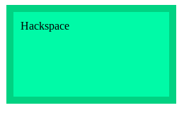
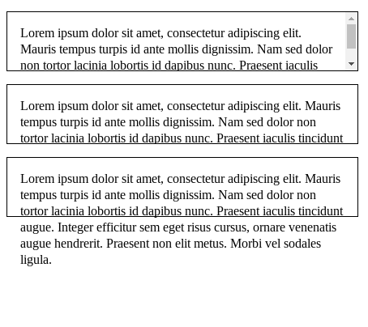
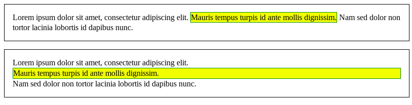

# El modelo de caja

El modelo de caja CSS es la base del diseño en la Web, cada elemento se representa como una caja rectangular, con el contenido, el relleno, el borde y el margen de la caja formados uno alrededor del otro como las capas de una cebolla. 

Cuando un navegador representa un diseño de página web, determina qué estilos se aplican al contenido de cada caja, qué tan grandes son las capas y dónde se ubican las cajas una en relación a la otra. Antes de entender cómo crear diseños de CSS, debe comprender el modelo de caja.

Las partes que componen cada caja y su orden de visualización desde el punto de vista del usuario son las siguientes:

* Contenido (__content__): se trata del contenido HTML del elemento (las palabras de un párrafo, una imagen, el texto de una lista de elementos, etc.)
* Relleno (__padding__): espacio libre opcional existente entre el contenido y el borde.
* Borde (__border__): línea que encierra completamente el contenido y su relleno.
* Margen (__margin__): separación opcional existente entre la caja y el resto de cajas adyacentes.

<p align="center">

</p>

El relleno y el margen son transparentes, por lo que en el espacio ocupado por el relleno se muestra el color o imagen de fondo (si están definidos) y en el espacio ocupado por el margen se muestra el color o imagen de fondo de su elemento padre (si están definidos). Si ningún elemento padre tiene definido un color o imagen de fondo, se muestra el color o imagen de fondo de la propia página (si están definidos).

Ahora veamos algunos ejemplos:

```html
<!DOCTYPE html>
<html lang="es">
    <head>
        <title>Hackspace</title>
        <style type="text/css">
            div{
                border: 10px solid #3EC483;
                background: #5DEAA8;
                height: 100px;
                width: 200px;
                padding: 10px;
                margin: 10px;
            }            
        </style>
    </head>

    <body>

        <div>Hackspace</div>
    </body>
</html>
```
Tendremos lo siguiente

<p align="center">
    
</p>

Además de establecer el ancho, alto, borde, relleno y margen de casillas, existen otras propiedades disponibles para cambiar la forma en que se comportan. Esta sección analiza esas otras propiedades.

## Desbordamiento (Overflow)

Cuando establece el tamaño de una caja con valores absolutos (por ejemplo, un ancho / altura de píxel fijo), es posible que el contenido no se ajuste al tamaño permitido, en cuyo caso el contenido se desborda del cuadro. Para controlar lo que ocurre en tales casos, podemos usar la propiedad __overflow__. Toma varios valores posibles, pero los más comunes son:

* __auto__: Si hay demasiado contenido, el contenido desbordado está oculto y se muestran barras de desplazamiento para permitir que el usuario se desplace para ver todo el contenido.
* __hidden__: Si hay demasiado contenido, el contenido desbordado está oculto.
* __visible__: Si hay demasiado contenido, el contenido desbordado se muestra fuera de la caja (este suele ser el comportamiento predeterminado).

Ahora veamos un ejemplo:

```html
<!DOCTYPE html>
<html lang="es">
    <head>
        <title>Hackspace</title>
        <style type="text/css">
            p {
              width  : 400px;
              height : 2.5em;
              padding: 1em 1em 1em 1em;
              border : 1px solid black;
            }
            .autoscroll { overflow: auto;    }
            .clipped    { overflow: hidden;  }
            .default    { overflow: visible; }  
        </style>
    </head>

    <body>
        <p class="autoscroll">
           Lorem ipsum dolor sit amet, consectetur adipiscing elit.
           Mauris tempus turpis id ante mollis dignissim. Nam sed
           dolor non tortor lacinia lobortis id dapibus nunc. Praesent
           iaculis tincidunt augue. Integer efficitur sem eget risus
           cursus, ornare venenatis augue hendrerit. Praesent non elit
           metus. Morbi vel sodales ligula.
        </p>

        <p class="clipped">
           Lorem ipsum dolor sit amet, consectetur adipiscing elit.
           Mauris tempus turpis id ante mollis dignissim. Nam sed
           dolor non tortor lacinia lobortis id dapibus nunc. Praesent
           iaculis tincidunt augue. Integer efficitur sem eget risus
           cursus, ornare venenatis augue hendrerit. Praesent non elit
           metus. Morbi vel sodales ligula.
        </p>

        <p class="default">
           Lorem ipsum dolor sit amet, consectetur adipiscing elit.
           Mauris tempus turpis id ante mollis dignissim. Nam sed
           dolor non tortor lacinia lobortis id dapibus nunc. Praesent
           iaculis tincidunt augue. Integer efficitur sem eget risus
           cursus, ornare venenatis augue hendrerit. Praesent non elit
           metus. Morbi vel sodales ligula.
        </p>
    </body>
</html>
```

<p align="center">
    
</p>

## Tipos de Cajas

Todo lo que hemos dicho hasta ahora se aplica a las cajas que representan elementos de nivel de bloque. Sin embargo, CSS tiene otros tipos de cajas que se comportan de manera diferente. El tipo de caja aplicado a un elemento está especificado por la propiedad __display__. Hay muchos valores diferentes disponibles para display, pero en este artículo nos enfocaremos en los tres más comunes: `block`, `inline`.

* Elementos `block`: Un elemento de nivel de bloque siempre comienza en una nueva línea y ocupa todo el ancho disponible (se extiende hacia la izquierda y hacia la derecha en la medida de lo posible).
* Elementos `inline`: Un elemento en línea no comienza en una nueva línea y solo ocupa tanto ancho como sea necesario.

Ahora veamos un ejemplo del uso de ambas propiedades:

```html
<!DOCTYPE html>
<html lang="es">
    <head>
        <title>Hackspace</title>
        <style type="text/css">
            p {
              padding : 1em;
              border : 1px solid black;
            }

            span {
              border : 1px solid green;
              background-color: yellow;
            }

            .inline { display: inline; }
            .block { display: block; }
        </style>
    </head>

    <body>
        <p>
           Lorem ipsum dolor sit amet, consectetur adipiscing elit.
           <span class="inline"> Mauris tempus turpis id ante mollis dignissim.</span>
           Nam sed dolor non tortor lacinia lobortis id dapibus nunc.
        </p>

        <p>
          Lorem ipsum dolor sit amet, consectetur adipiscing elit.
          <span class="block"> Mauris tempus turpis id ante mollis dignissim.</span>
          Nam sed dolor non tortor lacinia lobortis id dapibus nunc.
        </p>
    </body>
</html>
```

<p align="center">
    
</p>
