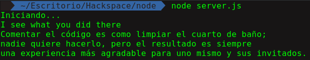
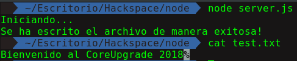
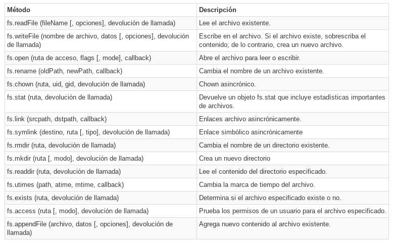

<h3> Semana 3 </h3>
<h1> Sistema de Archivos </h1>

Node.js incluye el módulo [__fs__](https://nodejs.org/api/fs.html) para acceder al sistema de archivos físico. El módulo fs es responsable de todas las operaciones de E/S de archivos asíncronas o síncronas.

Veamos algunos de los ejemplos comunes de operación de E/S usando el módulo fs.

Para ello vamos a crear un archivo llamado __frase.txt__

```
Comentar el código es como limpiar el cuarto de baño; nadie quiere hacerlo, pero el resultado es siempre una experiencia más agradable para uno mismo y sus invitados.
```

Para poder entender un poco de que son los callbacks leer:
* https://es.stackoverflow.com/questions/96218/qu%C3%A9-es-un-callback
* http://mialtoweb.es/callbacks-en-javascript/
* http://anexsoft.com/p/112/javascript-que-son-como-usar-y-ejemplos-del-uso-de-callbacks


### Leyendo archivos

Usaremos el método `fs.readFile()` para leer el archivo físico de forma asíncrona.

En nuestro server.js:

```javascript
// En este ejemplo vamos a leer nuestro archivo frase.txt  de manera asíncrona
console.log("Iniciando...");

// Importamos el modulo fs
var fs = require('fs');

// El método readfile leera nuestro archivo frase.txt
// Y para imprirlo decodificaremos usando utf8
// Y el tercer argumento es un callback
fs.readFile('frase.txt','utf8',function (err, data) {
    // Dentro del callback
    if (err) {
        console.log("Se ha producido un error!!");
        console.log("RUUUUN");
    }

    console.log(data);
});

console.log("I see what you did there");
```
<p align="center">
    
</p>

Te preguntarás por qué la ultima linea se ejecutó antes que leyeramos el archivo, esto se debe a la naturaleza asincrónica del método readFile. Pero que quiere decir esto?.

No vamos a entrar en detalles que es la programación asíncrona pero para que lo entiendas puedes leer los siguientes articulos que te ayudarán a entender este modo de programar.

* https://carlosazaustre.es/manejando-la-asincronia-en-javascript/
* https://medium.freecodecamp.org/understanding-asynchronous-javascript-callbacks-through-household-chores-e3de9a1dbd04

Usaremos funciones asíncronas a lo largo del curso ya que en cierto modo son más eficaces y son el porque Node.js se ha vuelto tan popular.

### Escritura de archivos

Usaremos el método `fs.writeFile()` para escribir datos en un archivo. Si el archivo ya existe, sobrescribe el contenido existente; de ​​lo contrario, crea un nuevo archivo y escribe datos en él.

En nuestro server.js

```javascript
console.log("Iniciando...");
var fs = require('fs');

// El primer argumento es el nombre del archivo
// El segundo argumento es lo que vamos a escribir en nuestro archivo
// Y el ultimo es el callback

fs.writeFile('test.txt', 'Bienvenido al CoreUpgrade 2018', function (err) {
    if (err)
        console.log(err);
    else
        console.log('Se ha escrito el archivo de manera exitosa!');
});
```
<p align="center">
    
</p>

Existen otros métodos para manejar archivos como:
<p align="center">
    
</p>

