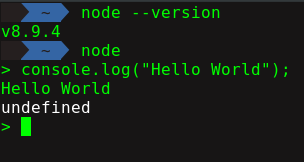
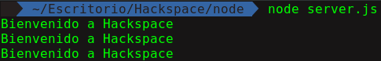

<h3> Semana 3 </h3>
<h1> Node.js </h1>

<p align="center">

</p>

<h2>¿Qué es Node.js?</h2>

En los primeros años de la web, el uso de javascript solo se limitaba a los buscadores, pero esto ha cambiado, las nuevas tecnologías, frameworks han ido evolucionando con los años, y ahora javascript se ha convertido en uno de los lenguajes más usados en el mundo. Ahora su uso no solo se limita a los buscadores, sino tambien de lado del servidor.

Para ejecutar el código JavaScript en el backend, este necesita ser interpretado y, bueno, ejecutado, Esto es lo que Node.js realiza, haciendo uso de la Maquina Virtual V8 de Google, el mismo entorno de ejecución para JavaScript que Google Chrome utiliza.

Además, Node.js viene con muchos módulos útiles, de manera que no tienes que escribir todo de cero, como por ejemplo, algo que ponga un string a la consola.

Entonces, Node.js es en realidad dos cosas: un entorno de ejecución y una librería.

Para definirlo de manera concreta, (según wikipedia) Node.js es un entorno en tiempo de ejecución multiplataforma código abierto, para la capa del servidor (pero no limitándose a ello) basado en el lenguaje de programación [ECMAScript](https://nodejs.org/es/download/package-manager/), asíncrono, con I/O de datos en una arquitectura orientada a eventos y basado en el [motor V8 de Google](https://es.wikipedia.org/wiki/V8_(motor_JavaScript)).

<h3>Instalación</h3>

Para instalar Node.js seguir la guía de [instalación](https://nodejs.org/es/download/package-manager/)

<h3>Ventajas</h3>

1. JavaScript es utilizado por Node.js, es decir es un lenguaje muy sencillo. Por lo tanto, a un programador que sepa javascript le resultará fácil aprenderlo.
2. Node.js ofrece un entorno de tiempo de ejecución de código abierto, por lo que es compatible con el almacenamiento en caché de módulos individuales.
3. La I/O asincrónica controlada por eventos ayuda en el manejo concurrente de solicitudes.
4. La comunidad es muy activa y vibrante con varios códigos compartidos por GitHub, etc.
5. Como se trata de un programa de subproceso único, ofrece varias opciones para tener un buen control sobre las ejecuciones en tiempo de ejecución, como los callbacks y los event-loops.
6. La gran cantidad de paquetes NPM que sigue creciendo y aporta una gran cantidad de módulos.
7. Streaming de archivos grandes también es posible con Node.js.

<h3>Desventajas</h3>

1. Uno de los mayores inconvenientes de Node.js es que no es consistente. Varias empresas de desarrollo consideran que la API sigue mejorando a intervalos frecuentes.
2. Si desea mejorar la escalabilidad de Node.js, es esencial contar con un enfoque de programación asincrónica. Sin embargo esto puede ser un poco díficil para principiantes.
3. Si se desea implementar un sistema que requiera de una gran cantidad de procesos Inadecuado para aplicaciones web grandes y complicadas como Node.js actualmente, no es compatible con las dos programaciones multiproceso.
5. No se recomienda su uso para tareas computacionales intensivas.

<h3>Recursos</h3>

Este pequeño curso es sólo una introducción si deseas saber más:

* [Quora](https://www.quora.com/What-are-the-best-resources-for-learning-Node-js?)
* [StackOverflow](https://stackoverflow.com/questions/2353818/how-do-i-get-started-with-node-js/5511507#5511507)

<h3>Empecemos!</h3>

Luego de haber instalado node verificamos en el terminal:

<p align="center">

</p>

Vemos que node es muy parecido a Javascript, sin embargo a diferencia de este, podemos acceder a más funciones que nos permite hacer uso de más recursos de la computadora en vez del navegador.

Ahora vamos a crear una carpeta donde almacenaremos nuestros proyectos, y luego creamos un archivo llamado __"server.js"__.

```javascript
var place= "Hackspace";
var i = 0;

while(i < 3){
    console.log(`Bienvenido a ${place}`);
    i++;
}
```

Para correr nuestro archivo "server.js" usamos en el terminal:

```bash
node server.js
```

<p align="center">

</p>
