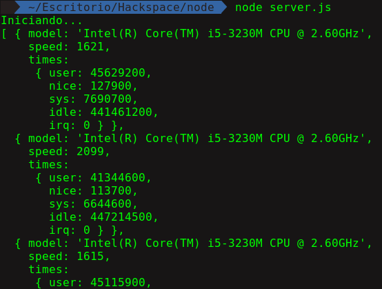

<h3> Semana 3 </h3>
<h1> Módulos </h1>

<h2>¿Qué es un módulo?</h2>

Un módulo en Node.js es una funcionalidad simple o compleja organizada en archivos JavaScript únicos o múltiples que pueden reutilizarse a través de la aplicación Node.js.

Cada módulo en Node.js tiene su propio contexto, por lo que no puede interferir con otros módulos o contaminar el alcance global. Además, cada módulo se puede colocar en un archivo .js por separado en una carpeta separada.

Node.js implementa CommonJS modules estándar . CommonJS es un grupo de voluntarios que define los estándares de JavaScript para aplicaciones de servidor web, escritorio y consola.

Tipos de módulos:
Node.js incluye tres tipos de módulos:

* Módulos centrales
* Módulos locales
* Módulos de terceros

<h3> Módulos centrales </h3>

Los módulos principales, core modules o tambien buil-in modules incluyen las mínimas funcionalidades de Node.js. Estos módulos principales se compilan en su distribución binaria y se cargan automáticamente cuando se inicia el proceso Node.js. Sin embargo, primero debe importar el módulo central para usarlo en su aplicación.

Algunos de los más importantes son:

* __http__: El módulo http incluye clases, métodos y eventos para crear el servidor http Node.js.
* __url__: El módulo url incluye métodos para la resolución y el análisis de URL.
* __path__:	El módulo path incluye métodos para tratar las rutas de archivos.
* __fs__: El módulo fs incluye clases, métodos y eventos para trabajar con archivos de E/S.
* __util__:	El módulo util incluye funciones de utilidad útiles.

Otros más en: https://nodejs.org/api/modules.html

Para cargar estos módulos se deben importar usando función `require()` como se muestra a continuación

```javascript
var module = require('nombre_del_modulo');
```

La función require () devolverá un objeto, función, propiedad o cualquier otro tipo de JavaScript, dependiendo de lo que devuelva el módulo especificado.

Por ejemplo vamos a utilizar el modulo built-in llamado [__'os'__](https://nodejs.org/api/os.html), en nuestro server.js para ver las carácteristicas de nuestro servidor:

```javascript
// server.js
console.log("Iniciando...");
var os_module = require('os');

console.log(os_module.cpus());
```

Nos da como resultado:

<p align="center">
    
</p>

<h3> Módulos locales </h3>

Los módulos locales son módulos creados localmente en su aplicación Node.js. Estos módulos incluyen diferentes funcionalidades de su aplicación en archivos y carpetas separados. También puede empaquetarlo y distribuirlo a través de NPM, para que la comunidad Node.js pueda usarlo.

Ahora vamos a escribir nuestro primer módulo llamado __"bienvenida.js"__

```javascript
// bienvenida.js

console.log("Dentro del modulo...")

// Creamos un objeto llamado welcome
// Con un atributo y 2 métodos
var welcome = {
    name: 'Hackspace',
    welcomeMessage: function(){
        console.log("Bienvenidos al CoreUpgrade 2018");
    },
    goodByeMessage: function(){
        console.log("Espero que aprendan nuevas cosas");
    }
};

// Con module exports, exportamos este objeto para poder usarlo luego
module.exports = welcome;
```

Ahora creamos otro archivo llamado __"server.js"__ donde llamaremos a nuestro módulo que hemos creado  anteriormente, para ello haremos uso de la función `require()` que usamos anteriormente:

```javascript
// server.js
console.log("Iniciando...");

// cargamos el modulo haciendo uso de require()
// Debemos tener cuidado con la ruta del archivo bienvenida.js
// En este ejemplo ambos archivos estan en la misma carpeta
var modulo = require('./bienvenida.js');

// Luego de cargar el modulo vamos a ver el atributo del objeto name
console.log(modulo.name);

// Hacemos lo mismo con los metodos de nuestro módulo
modulo.welcomeMessage();
modulo.goodByeMessage();
```

Y listo tenemos nuestro primer módulo corriendo!! :D

<p align="center">
    
</p>

<h2>NPM</h2>

Cuando hablamos de Node.js, una cosa que definitivamente no debe omitirse es integrarlo en el apoyo de la gestión de paquetes utilizando la herramienta NPM (Node Package Manager) que viene por defecto con cada instalación de Node.js.

La idea de usar NPM es que nos da un conjunto de componentes reutilizables disponibles públicamente a través de una fácil instalación a través de un repositorio en línea, con la versión y la dependencia de gestión.

Una lista completa de los paquetes de módulos puede encontrarse en el sitio web de NPM Https://npmjs.org/ o acceder utilizando la herramienta de la CLI de NPM que automáticamente se instala con Node.js. El módulo es un ecosistema abierto a todos, y cualquiera puede publicar su propio módulo que será incluido en el repositorio de NPM. Una breve introducción a la NPM (un poco viejo, pero sigue siendo válido) se puede encontrar en http://howtonode.org/introduction-to-npm.

Algunos de los paquetes más usados son:

* Express: Es un framework de desarrollo web para Node.js, y el estándar de facto para la mayoría de aplicaciones Node.js de hoy en día.
* socket.io : Componente del servidor de los dos componentes de websockets más comúnes en la actualidad.
* mongo y mongoose: mongoDB wrappers para proporcionar la API para bases de datos de objetos MongoDB en Node.js.
* lodash: La biblioteca de utilidades más popular de JavaScript, nos permite trabajar de manera más sencilla arrays, objetos, cadenas, etc.
* request: nos permite hacer llamadas http y https.

Existen muchos más, nunca terminaríamos si siguieramos....

Ahora antes de empezar, vamos a iniciar nuestro proyecto haciendo uso del comando __npm init__ el cual creará un archivo llamado __package.json__ donde almacenará información de nuestro proyecto como nombre, dependencias, scripts, licencias, etc.

Este comando nos hará algunas preguntas, si queremos dejar en blanco solo le damos enter:

<p align="center">
    
</p>

Luego nos creará un archivo llamado _package.json_:

<p align="center">
    
</p>

Ahora vamos a usar como ejemplo el paquete __lodash__:

Para instalar un modulo de terceros o de NPM usamos:

```bash
# npm install paquete o modulo
npm install lodash
```

Al instalar lodash añadirá una dependencia llamada lodash, y además cada vez que instalemos un nuevo modulo estos se almacenarán automaticamente en una carpeta llamada __node_modules__:

<p align="center">
    
</p>

Por ahora vamos a ignorar los warnings, pero vemos que tenemos nuestro modulo ya cargado, ahora para usarlo vamos a nuestro server.js:

```javascript
// server.js
console.log('Iniciando...');

// Cargamos el modulo lodash
// No es necesario indicar la ruta node_modules
// Por convencion lodash se carga con el simbolo "_"
const _ = require('lodash');

var array = ['Welcome'];
var other = _.concat(array, 'to', 'HackSpace', 'CoreUpgrade',2018);

console.log(other);
console.log(array);
```

<p align="center">
    
</p>

Cuando trabajamos en proyectos con otras personas, la carpeta node_modules puede llegar a pesar demasiado, por lo cual no es recomendable subir a github o a otro repositorio (usar .gitignore), pero que pasa si otra persona desea colaborar con nuestro proyecto, o si necesitamos instalar dependencias. Para ello hacemos uso del flag --save.

Ahora vamos a probar con otro módulo que usaremos luego llamado express:

<p align="center">
    
</p>

Tambien podemos instalar modulos de manera global usando la bandera "__-g__", por ejemplo al instalar el paquete nodemon:

```bash
npm install -g nodemon
```
Si estas en linux o MacOS prueba usando sudo en caso de error.


