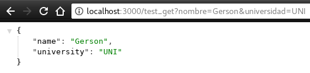
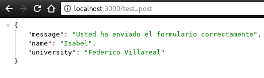

<h3> Semana 3 </h3>
<h1> Express </h1>

Ya vimos como crear un servidor web con node.js sin embargo manejar las rutas con solo http puede ser una tarea un poco tediosa, allí es donde entra Express, un framework que nos facilita el trabajo.

<h2>¿Qué es express?</h2>

Express es el framework web más popular de Node, y es la librería subyacente para un gran número de otros frameworks web de Node populares. Proporciona mecanismos para:

* Escritura de manejadores de peticiones con diferentes verbos HTTP en diferentes caminos URL (rutas).
* Integración con motores de renderización de "vistas" para generar respuestas mediante la introducción de datos en plantillas.
* Establecer ajustes de aplicaciones web como qué puerto usar para conectar, y la localización de las plantillas que se utilizan para renderizar la respuesta.
* Añadir procesamiento de peticiones "middleware" adicional en cualquier punto dentro de la tubería de manejo de la petición.

A pesar de que Express es en sí mismo bastante minimalista, los desarrolladores han creado paquetes de middleware compatibles para abordar casi cualquier problema de desarrollo web. Hay librerías para trabajar con cookies, sesiones, inicios de sesión de usuario, parámetros URL, datos POST, cabeceras de seguridad y muchos más. Puedes encontrar una lista de paquetes middleware mantenida por el equipo de Express en [Express Middleware](https://expressjs.com/es/resources/middleware.html) (junto con una lista de algunos de los paquetes más populares de terceros).

Vamos a reescribir el ejemplo que hicimos en el Servidor Web ahora usando express:

Antes de ello instalamos express usando el terminal:
```bash
npm install express --save
```

```javascript
// usamos el framework express
var express = require('express');
var app = express();

app.get('/', function(req, res) {
    res.writeHead(200, { 'Content-Type': 'text/html' });
    res.write('<html><body><p>Bienvenido a Hackspace</p></body></html>');
    res.end();
});

app.get('/coreupgrade',function(req, res) {
    res.writeHead(200, { 'Content-Type': 'text/html' });
    res.write('<html><body><p>Bienvenido al CoreUpgrade 2018</p></body></html>');
    res.end();
});

app.get('/data',function(req, res) {
    var data = {
        name: 'Alan Turing',
        message: 'Computer Science is the best carrer!!!'
    }
    res.writeHead(200, { 'Content-Type': 'application/json' });
    res.write(JSON.stringify(data));
    res.end();
});

app.listen(3000, function() {
    console.log('El servidor web esta corriendo en el puerto 3000...!')
});
```
Corremos nuestra aplicación y vemos que sigue funcionando de la misma manera. Sin embargo esta manera de trabajar es mucho más ordenada y además mejora la calidad de nuestro software.

<h2>Sirviendo archivos estáticos</h2>

Express proporciona un middleware llamado __express.static__ que viene junto a express para poder servir archivos estáticos, como imágenes, CSS, JavaScript, etc.

Simplemente debe pasar el nombre del directorio donde guarda los archivos estáticos al middleware express.static para comenzar a servir los archivos directamente. Por ejemplo, si mantiene sus imágenes, CSS y archivos JavaScript en un directorio llamado public, puede hacer esto:

```javascript
app.use(express.static('public'));
```

Ahora vamos a estructurar nuestro proyecto de una mejor manera:

* node_modules
* package.json
* public
    * img
        * hackspace.png
    * index.html
* server.js

Para nuestro index.html usamos:

```html
<!DOCTYPE html>
<html lang="en">
<head>
    <meta charset="UTF-8">
    <title>CoreUpgrade 2018</title>
</head>
<body>
    
    <h1>Bienvenido al CoreUpgrade</h1>

</body>
</html>
```
Modificamos un poco nuestro server.js:

```javascript
var express = require('express');
var app = express();

app.use(express.static('public'));

app.get('/', function(req, res) {
    res.sendFile(__dirname + "/" + "index.htm");
});

app.listen(3000, function() {
    console.log('El servidor web esta corriendo en el puerto 3000...!')
});
```

Vemos nuestra página! :D

<p align="center">
    
</p>

Ahora vamos a trabajar con formularios para ver como funcionan los métodos POST y GET:

Para ello vamos a agregar un formulario a nuestro html:

```html
<!DOCTYPE html>
<html lang="en">
<head>
    <meta charset="UTF-8">
    <title>CoreUpgrade 2018</title>
</head>
<body>
    
    <h1>Bienvenido al CoreUpgrade</h1>

    <form action = "http://localhost:3000/test_get" method = "GET">
        Nombre: <input type = "text" name = "nombre">  <br>
        Universidad: <input type = "text" name = "universidad">
         <input type = "submit" value = "Submit">
    </form>

</body>
</html>
```

Y modificamos nuestro server.js

```javascript
var express = require('express');
var app = express();

app.use(express.static('public'));

app.get('/', function(req, res) {
    res.sendFile(__dirname + "/" + "index.htm");
});

app.get('/test_get', function (req, res) {
    // Prepare output in JSON format
    response = {
        name: req.query.nombre,
        university: req.query.universidad
    };
    res.writeHead(200, { 'Content-Type': 'application/json' });
    res.write(JSON.stringify(response));
    res.end();
})

app.listen(3000, function() {
    console.log('El servidor web esta corriendo en el puerto 3000...!')
});
```
Ahora enviamos nuestros datos al formulario

<p align="center">
    
</p>
Y voilá, tenemos como respuesta un json con nuestros datos:

<p align="center">
    
</p>

Ahora haremos lo mismo usando el método POST pero para ello primero tenemos que instalar un módulo de middleware llamado body-parser para poder manejar la solicitud, este módulo analiza los datos codificados JSON, de búfer, de cadena y de url enviados mediante la solicitud HTTP POST:

```bash
npm install body-parser --save
```

Vamos a hacer un ligero cambio en nuestro index.html:

```html
<!-- En la cabecera del formulario cambiamos -->
<form action="http://localhost:3000/test_post" method="POST">
```

Ahora modificamos nuestro server.js para poder usar el método POST

```javascript
var express = require("express");
var app = express();

var bodyParser = require("body-parser");

app.use(bodyParser.urlencoded({ extended: false }));
app.use(express.static("public"));

app.get("/", function(req, res) {
  res.sendFile(__dirname + "/" + "index.htm");
});

app.post("/test_post", function(req, res) {
  // Prepare output in JSON format
  response = {
    message: "Usted ha enviado el formulario correctamente",
    name: req.body.nombre,
    university: req.body.universidad
  };
  res.writeHead(200, { "Content-Type": "application/json" });
  res.write(JSON.stringify(response));
  res.end();
});

app.listen(3000, function() {
  console.log("El servidor web esta corriendo en el puerto 3000...!");
});
```

<p align="center">
    
</p>

Observamos que hemos enviado el formulario de manera correcta con el método POST!

<p align="center">
    
</p>

