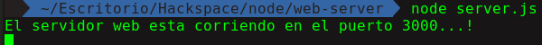
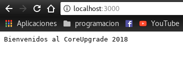
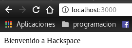
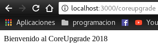
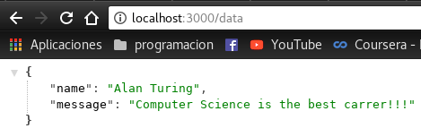

<h3> Semana 3 </h3>
<h1> Servidor web con Node.js </h1>

Hemos hablado de lo increíble que es node y el uso de Javascript en en lado del servidor, y en esta parte nos enfocaremos en su uso como servidor web.r ahora: ¡compilarlo!

Esta sección manejaremos algunas funciones básicas del modulo `http`, una libreria que viene con Node.js utilizada para manejar solicitudes a través de Internet. Con solo unas pocas lineas podemos construir una aplicacion que podrá comunicarse con nuestro navegador web. Los servidores web son la base de la mayoría de las aplicaciones web de Node.js. Le permiten cargar imágenes y páginas web HTML a los usuarios de su aplicación.

<h2> Pero.... ¿Qué es un servidor web? </h2>

Un servidor web es un software diseñado para responder a solicitudes en Internet mediante la carga o el procesamiento de datos. Piense en un servidor web como un cajero de banco, cuyo trabajo es procesar su solicitud para depositar, retirar o simplemente ver dinero en su cuenta. Así como el cajero del banco sigue un protocolo para garantizar que procesen su solicitud correctamente, los servidores web siguen el Protocolo de transferencia de hipertexto (HTTP), un sistema estandarizado observado globalmente para la visualización de páginas web y el envío de datos a través de Internet.

Una forma en que un cliente (su computadora) y un servidor se comunican es mediante el uso de verbos HTTP. Estos verbos indican qué tipo de solicitud se está realizando. Por ejemplo, ¿está el usuario intentando cargar una página web nueva o está actualizando información en su página de perfil? El contexto de la interacción de un usuario con una aplicación es una parte importante del ciclo de solicitud-respuesta.

Estos son los dos métodos HTTP más utilizados que encontrará:

* __GET__ Este método se usa para solicitar información de un servidor. Normalmente, un servidor responde con contenido que puede ver en su navegador (por ejemplo, hacer clic en un enlace para ver la página de inicio de un sitio).
* __POST__ Este método se usa para enviar información al servidor. Un servidor puede responder con una página HTML o redirigirlo a otra página en la aplicación después de procesar sus datos (por ejemplo, completar y enviar un formulario de registro).

Considere lo que ocurre cuando visita google.com. Detrás de escena, en realidad está haciendo una solicitud a los servidores de Google, que a su vez le envía una respuesta, presentando su famosa página de inicio de búsqueda de Google.  En la siguiente imagen tenemos un ejemplo de como funciona:

<p align-text="center">
    
</p>

Cuando ingresa la URL que desea ver en su navegador, se envía una solicitud HTTP a una computadora física en otro lugar. Esta solicitud contiene cierta información que indica si desea cargar una página web o enviar información a esa computadora.

Puede construir una aplicación elegante con muchos detalles, pero en el núcleo está el servidor web, que transmite su comunicación a través de Internet. Estos conceptos tendrán más sentido a medida que avancemos. Por ahora, comencemos a construir nuestro servidor web.

Vamos a crear una nueva carpeta e iniciar nuestro web server:

```bash
mkdir web-server
cd web-sever
npm init
```

Luego de contestar las preguntas creamos nuestro archivo principal llamado `server.js`

```javascript
// Primero importamos el modulo http
var http = require('http'); // 1 - Import Node.js core module

// Creamos nuestro server con el metodo createServer de http
var server = http.createServer(function (request, response) {
    // Acá manejaremos las peticiones
    // Creamos una cabecera donde le vamos a pasar como argumento el status (200 = OK)
    // Y además especificamos que el tipo de documento
    response.writeHead(200, {
         'Content-Type': 'text/plain'
    });
    // Mandamos nuestro mensaje de respuesta
    response.write('Bienvenidos al CoreUpgrade 2018')
    // Terminamos la respuesta
    response.end();

});

// Esperamos las peticiones en el puerto 3000
server.listen(3000); //3 - listen for any incoming requests

console.log('El servidor web esta corriendo en el puerto 3000...!')
```
En el terminal corremos nuestra aplicación:

<p align-text="center">
    
</p>

Luego abrimos en nuestro navegador:

<p align-text="center">
    
</p>

Por ahora estamos recibiendo una respuesta por parte del servidor, pero cómo hacemos para realizar una petición o __request__ ?

```javascript
// Primero importamos el modulo http
var http = require('http');

var server = http.createServer(function (request, response) {

    // Que pasa si hacemos una peticion al URL actual
    if (request.url == '/') {
        // enviamos una respuesta
        // En este caso el tipo será una html
        response.writeHead(200, { 'Content-Type': 'text/html' });
        response.write('<html><body><p>Bienvenido a Hackspace</p></body></html>');
        response.end();
    }
    else if (request.url == "/coreupgrade") {
        response.writeHead(200, { 'Content-Type': 'text/html' });
        response.write('<html><body><p>Bienvenido al CoreUpgrade 2018</p></body></html>');
        response.end();
    }
    else if (request.url == "/data") {
        // Ahora vamos a enviar un objeto
        var data = {
            name: 'Alan Turing',
            message: 'Computer Science is the best carrer!!!'
        }
        response.writeHead(200, { 'Content-Type': 'application/json' });
        response.write(JSON.stringify(data));
        response.end();
    }
    else{
        response.end('Invalid Request!');
    }
});

server.listen(3000);

console.log('El servidor web esta corriendo en el puerto 3000...!')
```

Corremos nuevamente nuestro servidor haciendo:

```bash
node server.js
```

Vemos que si hacemos una peticion a cada URL en nuestro navegador nos da diferentes respuestas:

En este caso "__localhost:3000/__" es la ruta raíz
<p align-text="center">
    
</p>

Hacemos una petición a la ruta /coreupgrade:

<p align-text="center">
    
</p>

Ahora finalmente vamos a hacer una petición a la ruta /data:

<p align-text="center">
    
</p>

Y de esta manera podemos crear un servidor web manejando diferentes peticiones y respuestas.
